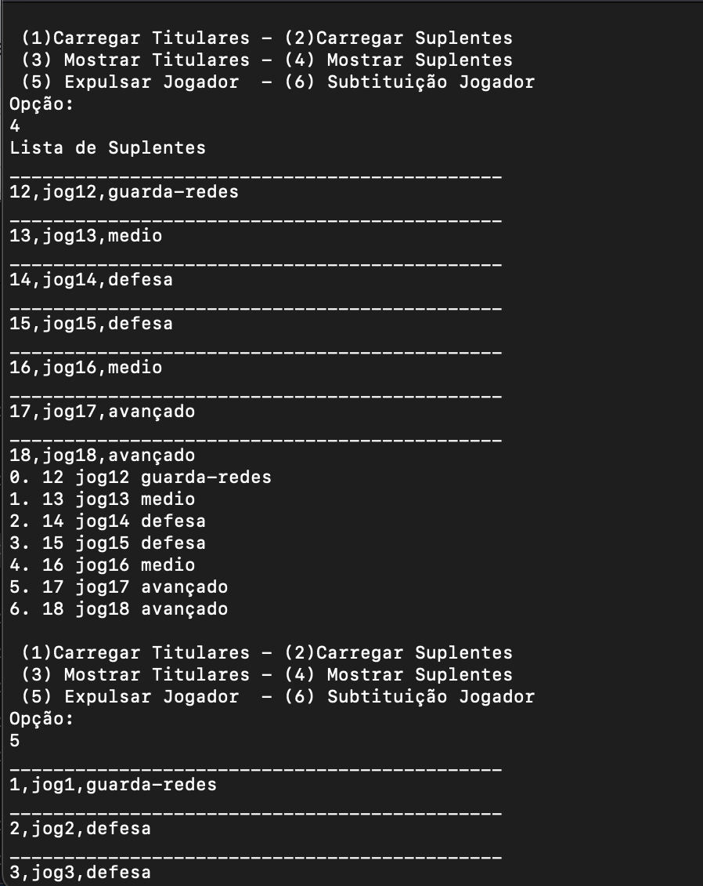

<h1 align="center">
    
</h1>

Trabalho em C++
    
Programa de jugadores de futebol em C++, sobre expulção, subtituição de jogadores, listagem de jogadores

📌 Programa InfoJogo  em C++
------------------
O projeto foi feito em C++.

The project was done with C++.

🔧 Tecnologias utilizadas:
------------------

- C++ e QtCreator 

💬 Fale comigo
------------------
[*Entre em contato comigo*](https://www.linkedin.com/in/ivo-baptista-3712144/)

If you have run out of energy or time for your project, put a note at the top of the README saying that development has slowed down or stopped completely. Someone may choose to fork your project or volunteer to step in as a maintainer or owner, allowing your project to keep going. You can also make an explicit request for maintainers.
